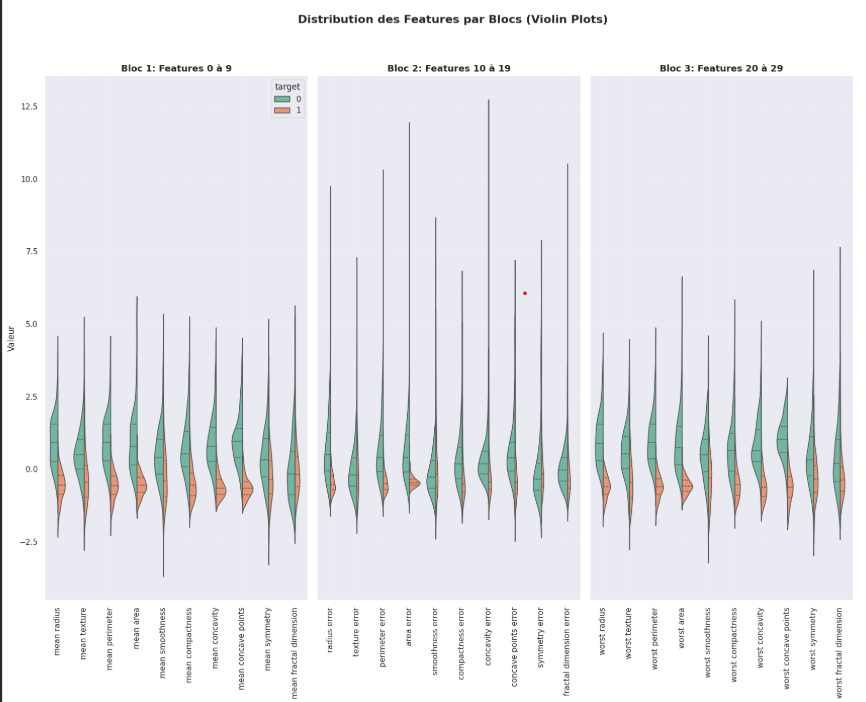
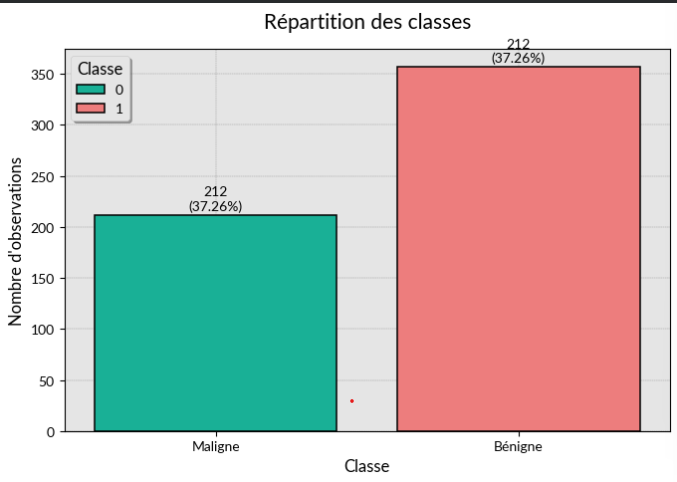
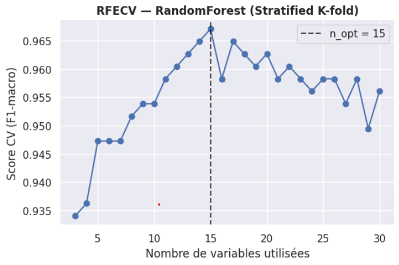
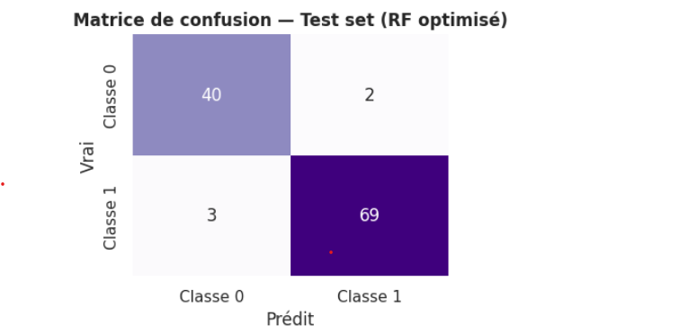
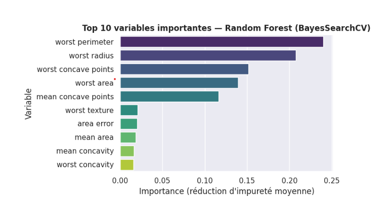

# Classification de tumeurs mammaires par Machine Learning

> Projet de classification supervisée mené de bout en bout : exploration des données, réduction de la redondance, sélection de variables, optimisation d'un Random Forest et évaluation sur un jeu de test indépendant.


## Résultats en bref

Le modèle final est un **Random Forest optimisé par `BayesSearchCV`**, entraîné sur **10 variables** sélectionnées. Sur le jeu de test indépendant de 114 observations, il obtient :

| Métrique | Score sur le jeu de test |
|---|---:|
| Accuracy | **95,61 %** |
| F1-macro | **95,31 %** |
| ROC-AUC | **99,37 %** |

Ces résultats décrivent une expérimentation sur un jeu de données public et contrôlé. Ils ne constituent pas une validation clinique et ne permettent pas d'utiliser le modèle comme dispositif de diagnostic médical.

## Sommaire

1. [Contexte et problématique](#contexte-et-problématique)
2. [Objectifs](#objectifs)
3. [Jeu de données](#jeu-de-données)
4. [Méthodologie](#méthodologie)
5. [Analyse exploratoire](#analyse-exploratoire)
6. [Déséquilibre des classes](#déséquilibre-des-classes)
7. [Prétraitement et sélection des variables](#prétraitement-et-sélection-des-variables)
8. [Modélisation et critères de comparaison](#modélisation-et-critères-de-comparaison)
9. [Résultats](#résultats)
10. [Interprétation métier et limites](#interprétation-métier-et-limites)
11. [Compétences démontrées](#compétences-démontrées)
12. [Technologies utilisées](#technologies-utilisées)
13. [Organisation du dépôt](#organisation-du-dépôt)
14. [Installation et exécution](#installation-et-exécution)
15. [Pistes d'amélioration](#pistes-damélioration)
16. [Auteur](#auteur)

## Contexte et problématique

La classification des tumeurs mammaires constitue un problème de décision à fort enjeu : distinguer une tumeur maligne d'une tumeur bénigne à partir de caractéristiques morphologiques mesurées sur des noyaux cellulaires.

Ce projet étudie la problématique suivante :

> **Peut-on construire un modèle de classification performant et interprétable, reposant sur un nombre limité de variables, pour différencier les tumeurs malignes des tumeurs bénignes ?**

La démarche ne cherche pas uniquement à maximiser un score. Elle vise également à limiter la redondance entre variables, à comparer plusieurs stratégies de sélection et à conserver un modèle suffisamment parcimonieux pour faciliter son interprétation.

## Objectifs

- Comprendre la structure et la qualité du jeu de données.
- Étudier la distribution des variables selon le diagnostic.
- Identifier les corrélations et les groupes de variables redondantes.
- Tenir compte de la différence de représentation entre les deux classes.
- Comparer plusieurs méthodes de sélection de variables.
- Optimiser les hyperparamètres d'un Random Forest.
- Évaluer le modèle final sur des données non utilisées pour l'entraînement.
- Interpréter les variables les plus contributives sans leur attribuer de relation causale.

## Jeu de données

Les données sont chargées directement avec `sklearn.datasets.load_breast_cancer`.

| Élément | Description |
|---|---|
| Nombre d'observations | 569 |
| Variables explicatives | 30 variables numériques continues |
| Variable cible | `target` |
| Classe `0` | Tumeur maligne — 212 observations (37,26 %) |
| Classe `1` | Tumeur bénigne — 357 observations (62,74 %) |
| Valeurs manquantes | Aucune valeur manquante observée |

Les 30 variables décrivent dix propriétés des noyaux cellulaires — rayon, texture, périmètre, aire, régularité, compacité, concavité, points concaves, symétrie et dimension fractale — sous trois formes :

- valeur moyenne (`mean`) ;
- erreur standard (`error`) ;
- valeur la plus défavorable ou extrême (`worst`).

## Méthodologie

Le projet suit les étapes suivantes :

1. chargement et contrôle de la qualité des données ;
2. statistiques descriptives et analyse des distributions ;
3. analyse du déséquilibre de la cible ;
4. standardisation temporaire pour comparer visuellement les distributions ;
5. étude de la matrice de corrélation ;
6. séparation stratifiée entraînement/test à 80/20 ;
7. sélection de variables par corrélation, test de Mann–Whitney, information mutuelle et RFECV ;
8. évaluation par validation croisée stratifiée ;
9. optimisation du Random Forest par recherche aléatoire, Optuna et `BayesSearchCV` ;
10. sélection d'un compromis entre performance et interprétabilité ;
11. évaluation finale sur le jeu de test conservé à l'écart.

## Analyse exploratoire

L'analyse exploratoire met en évidence plusieurs caractéristiques :

- de nombreuses variables présentent une distribution asymétrique vers la droite ;
- plusieurs mesures de taille et de forme séparent visuellement les deux diagnostics ;
- `mean concavity`, `mean concave points`, `mean area` et `mean texture` apparaissent comme des variables discriminantes lors de l'analyse des distributions ;
- les familles rayon–périmètre–aire et compacité–concavité–points concaves présentent de fortes corrélations internes ;
- la standardisation est utilisée pour rendre les distributions comparables visuellement, mais elle n'est pas requise par le Random Forest final.

<!-- Capture à réaliser : sortie de la cellule 18, sous « Comparaison des distributions en fonction de la médiane ». Page PDF : [À compléter après export ; le notebook .ipynb ne possède pas de pagination fixe]. -->


> 📸 **Capture recommandée :** exporter la figure « Distribution des Features par Blocs (Violin Plots) » de la cellule 18. Elle montre la séparabilité variable des deux classes selon les caractéristiques. Enregistrer l'image sous `assets/images/feature_distributions_by_class.png`.

<!-- Capture à réaliser : sortie de la cellule 29, section « Corrélation ». Page PDF : [À compléter après export]. -->


> 📸 **Capture recommandée :** exporter la matrice de corrélation de la cellule 29. Elle justifie la réduction des variables redondantes. Enregistrer l'image sous `assets/images/correlation_matrix.png`.

## Déséquilibre des classes

La cible présente un **déséquilibre modéré** : 357 observations bénignes contre 212 observations malignes. Ce rapport justifie une évaluation allant au-delà de l'accuracy.

Les mesures mises en place dans le notebook sont :

- une séparation entraînement/test stratifiée ;
- des validations croisées stratifiées ;
- l'utilisation de `class_weight="balanced"` dans plusieurs modèles de référence et dans les recherches Optuna ;
- la comparaison de l'accuracy, du F1-macro, de la ROC-AUC et des métriques par classe.

Aucun sur-échantillonnage de type SMOTE ni sous-échantillonnage n'est appliqué. Lors de la recherche bayésienne finale, `class_weight` est inclus dans l'espace de recherche et la meilleure configuration à 10 variables retient `class_weight=None`.

<!-- Capture à réaliser : sortie de la cellule 10, graphique « Répartition des classes ». Page PDF : [À compléter après export]. -->


> 📸 **Capture recommandée :** exporter le graphique de la cellule 10 présentant 212 tumeurs malignes et 357 tumeurs bénignes. Cette figure motive l'utilisation de métriques équilibrées. Enregistrer l'image sous `assets/images/class_distribution.png`.

## Prétraitement et sélection des variables

### Préparation des données

- Contrôle des valeurs manquantes : aucune valeur manquante détectée.
- Séparation des prédicteurs `X` et de la cible `y`.
- Split stratifié : 80 % pour l'entraînement et 20 % pour le test, avec `random_state=10`.
- Standardisation centrée-réduite utilisée uniquement pour certaines visualisations exploratoires.

### Stratégies de sélection comparées

1. **Filtrage par corrélation**  
   Un seuil absolu de 0,80 est utilisé pour identifier les paires fortement corrélées. Treize variables redondantes sont retirées, ce qui ramène l'espace étudié de 30 à 17 variables.

2. **Test de Mann–Whitney U**  
   Le test compare la distribution de chaque variable entre les deux classes. Parmi les variables les plus significatives figurent `worst perimeter`, `worst radius`, `worst area`, `mean concave points` et `worst concave points`.

3. **Information mutuelle avec `SelectKBest`**  
   Trois sous-ensembles sont évalués : K = 5, K = 10 et K = 15. Le sous-ensemble à 10 variables offre un compromis favorable entre performance et lisibilité.

4. **RFECV avec Random Forest**  
   La sélection récursive avec validation croisée retient 15 variables. Le modèle associé atteint une accuracy moyenne de 0,9648 ± 0,0128 en validation croisée.

<!-- Capture à réaliser : sortie de la cellule 56, graphique « RFECV — RandomForest (Stratified K-fold) ». Page PDF : [À compléter après export]. -->


> 📸 **Capture recommandée :** exporter la courbe RFECV de la cellule 56. Elle montre que le meilleur score observé est atteint avec 15 variables. Enregistrer l'image sous `assets/images/rfecv_feature_selection.png`.

### Variables retenues pour le modèle final

Le modèle final utilise les dix variables suivantes, issues de la sélection par information mutuelle après réduction correlationnelle :

| Variable | Famille d'information |
|---|---|
| `mean texture` | Texture moyenne |
| `mean area` | Aire moyenne |
| `mean concave points` | Points concaves moyens |
| `mean symmetry` | Symétrie moyenne |
| `area error` | Erreur standard de l'aire |
| `concave points error` | Erreur standard des points concaves |
| `worst area` | Aire la plus défavorable |
| `worst smoothness` | Régularité la plus défavorable |
| `worst concave points` | Points concaves les plus défavorables |
| `worst symmetry` | Symétrie la plus défavorable |

## Modélisation et critères de comparaison

Le notebook entraîne différentes configurations d'un même algorithme principal : le **Random Forest Classifier**.

Les axes de comparaison sont :

- le nombre et la méthode de sélection des variables ;
- l'accuracy ;
- le F1-macro, qui donne un poids identique aux deux classes ;
- la ROC-AUC, fondée sur les probabilités prédites ;
- la variabilité des scores entre les folds ;
- la parcimonie et l'interprétabilité du modèle.

Trois stratégies d'optimisation sont explorées :

- `RandomizedSearchCV` ;
- Optuna avec échantillonneur TPE ;
- `BayesSearchCV` de `scikit-optimize`.

Les recherches portent notamment sur le nombre d'arbres, la profondeur maximale, les seuils de division, la taille minimale des feuilles, le nombre de variables considéré à chaque division, le bootstrap, la pondération des classes et certains paramètres de régularisation.

## Résultats

### Effet de la sélection de variables

Le tableau suivant reprend les sorties de validation croisée à cinq folds du Random Forest de référence. Ces résultats sont directement comparables, car ils reposent sur le même split d'entraînement et le même schéma de validation.

| Ensemble de variables | Nombre de variables | Accuracy CV | F1-macro CV | ROC-AUC CV |
|---|---:|---:|---:|---:|
| Modèle complet | 30 | 0,9626 | 0,9596 | 0,9853 |
| Filtrage par corrélation | 17 | 0,9604 | 0,9575 | 0,9873 |
| Information mutuelle | 5 | 0,9451 | 0,9414 | 0,9844 |
| Information mutuelle | 10 | 0,9538 | 0,9505 | **0,9892** |
| Information mutuelle | 15 | 0,9560 | 0,9527 | 0,9886 |

La réduction à 10 variables conserve une grande partie de la performance tout en simplifiant le modèle. RFECV obtient une accuracy moyenne de 0,9648 avec 15 variables, mais le projet retient finalement la version à 10 variables afin de privilégier un compromis plus parcimonieux.

### Comparaison des stratégies d'optimisation

Les sorties brutes du notebook donnent les résultats suivants. Les protocoles ne sont pas entièrement homogènes — trois ou cinq folds et objectifs d'optimisation différents selon la méthode — ; cette table doit donc être lue comme une synthèse expérimentale, et non comme un classement statistique définitif.

| Optimisation | Variables | Accuracy CV affichée | F1-macro CV | ROC-AUC CV |
|---|---:|---:|---:|---:|
| Randomized Search | 10 | 0,9538 | 0,9506 | 0,9854 |
| Randomized Search | 15 | 0,9560 | 0,9530 | 0,9871 |
| Optuna | 10 | 0,9538 | 0,9573 | 0,9913 |
| Optuna | 15 | **0,9648** | [Non calculé dans une sortie dédiée] | [Non calculé dans une sortie dédiée] |
| BayesSearchCV | 10 | 0,9582 | 0,9552 | 0,9881 |
| BayesSearchCV | 15 | 0,9604 | 0,9573 | 0,9833 |

Pour `BayesSearchCV`, l'accuracy indiquée correspond au meilleur score moyen affiché parmi les configurations évaluées (`Précision max` dans le notebook). Le modèle retenu n'est donc pas celui qui maximise isolément l'accuracy : il s'agit du **Random Forest BayesSearchCV à 10 variables**, choisi pour son équilibre entre performance, robustesse et interprétabilité.

### Évaluation finale sur le jeu de test

| Indicateur | Résultat |
|---|---:|
| Observations de test | 114 |
| Accuracy | 0,9561 |
| F1-macro | 0,9531 |
| ROC-AUC | 0,9937 |
| Rappel — classe maligne (`0`) | 0,952 |
| Rappel — classe bénigne (`1`) | 0,958 |

La matrice de confusion est :

| Réel / Prédit | Maligne (`0`) | Bénigne (`1`) |
|---|---:|---:|
| Maligne (`0`) | 40 | 2 |
| Bénigne (`1`) | 3 | 69 |

Le modèle classe correctement 109 observations sur 114. Deux tumeurs malignes sont prédites comme bénignes, une erreur particulièrement importante dans le contexte métier et qui justifie une réflexion future sur le seuil de décision.

<!-- Capture à réaliser : sortie de la cellule 93, matrice de confusion du jeu de test. Page PDF : [À compléter après export]. -->


> 📸 **Capture recommandée :** exporter la matrice de confusion de la cellule 93. Elle rend immédiatement visibles les cinq erreurs de classification. Enregistrer l'image sous `assets/images/confusion_matrix.png`.

## Interprétation métier et limites

### Variables les plus contributives

L'importance Gini du modèle final place en tête :

1. `worst area` — 0,2634 ;
2. `worst concave points` — 0,2356 ;
3. `mean concave points` — 0,2004 ;
4. `mean area` — 0,1324 ;
5. `area error` — 0,0754.

Le modèle s'appuie donc principalement sur des indicateurs liés à la taille et à l'irrégularité des contours cellulaires. Ces importances mesurent la contribution des variables aux divisions des arbres ; elles n'indiquent ni le sens de l'effet ni une relation causale.

<!-- Capture à réaliser : sortie de la cellule 85, graphique « Top 10 variables importantes — Random Forest (BayesSearchCV) ». Page PDF : [À compléter après export]. -->


> 📸 **Capture recommandée :** exporter le graphique d'importance des variables de la cellule 85. Il rend le modèle plus interprétable et justifie le choix d'un sous-ensemble réduit. Enregistrer l'image sous `assets/images/feature_importance.png`.

### Limites

- Le jeu de données est de petite taille : 569 observations.
- Les performances proviennent d'un dataset public, propre et déjà structuré ; elles ne garantissent pas la généralisation à d'autres populations ou dispositifs de mesure.
- Aucune validation clinique ou externe n'est réalisée.
- Les protocoles de comparaison des optimiseurs ne sont pas strictement identiques.
- La sélection par information mutuelle est effectuée avant la validation croisée interne ; l'intégrer dans un `Pipeline` ou une validation croisée imbriquée réduirait le risque d'optimisme dans les scores CV.
- L'importance Gini peut favoriser certaines variables et ne fournit pas le sens de leur influence.
- Le seuil de classification par défaut n'est pas optimisé selon le coût métier des erreurs, alors qu'un cas malin prédit bénin est particulièrement critique.
- La calibration des probabilités n'est pas étudiée.

## Compétences démontrées

- Cadrage d'un problème de classification binaire.
- Analyse exploratoire de données numériques.
- Contrôle de qualité et statistiques descriptives.
- Visualisation avec Matplotlib, Seaborn et Plotly.
- Analyse des corrélations et de la multicolinéarité.
- Gestion méthodologique d'un déséquilibre de classes.
- Tests statistiques non paramétriques avec Mann–Whitney.
- Sélection de variables par filtre, information mutuelle et RFECV.
- Validation croisée stratifiée et comparaison multi-métriques.
- Optimisation d'hyperparamètres avec Randomized Search, Optuna et recherche bayésienne.
- Évaluation d'un classifieur par rapport de classification, ROC-AUC et matrice de confusion.
- Interprétation d'un modèle par importance des variables.
- Analyse critique des limites et des risques de fuite d'information.

## Technologies utilisées

| Catégorie | Outils |
|---|---|
| Langage | Python |
| Manipulation de données | NumPy, pandas |
| Machine Learning | scikit-learn |
| Tests statistiques | SciPy |
| Optimisation | Optuna, scikit-optimize |
| Visualisation | Matplotlib, Seaborn, Plotly |
| Environnement | Jupyter Notebook / Google Colab |

Version de Python utilisée pour la reproduction locale : **[À compléter]**.

## Organisation du dépôt

Structure actuelle et fichiers recommandés pour la publication :

```text
.
├── Breast_cancer.ipynb
├── README.md
├── requirements.txt                 # [À créer]
├── LICENSE                          # [À choisir]
└── assets/
    └── images/
        ├── class_distribution.png
        ├── feature_distributions_by_class.png
        ├── correlation_matrix.png
        ├── rfecv_feature_selection.png
        ├── feature_importance.png
        └── confusion_matrix.png
```

## Installation et exécution

### 1. Cloner le dépôt

```bash
git clone [URL_DU_DEPOT]
cd [NOM_DU_DEPOT]
```

### 2. Créer un environnement virtuel

```bash
python -m venv .venv
```

Activation sous Linux ou macOS :

```bash
source .venv/bin/activate
```

Activation sous Windows PowerShell :

```powershell
.venv\Scripts\Activate.ps1
```

### 3. Installer les dépendances

Lorsque le fichier `requirements.txt` aura été ajouté :

```bash
python -m pip install --upgrade pip
pip install -r requirements.txt
```

Installation directe correspondant aux bibliothèques importées dans le notebook :

```bash
pip install numpy pandas matplotlib seaborn scipy scikit-learn plotly optuna scikit-optimize jupyter
```

### 4. Lancer le notebook

```bash
jupyter notebook Breast_cancer.ipynb
```

Le dataset est chargé directement depuis `scikit-learn` : aucun fichier CSV externe n'est nécessaire.

## Pistes d'amélioration

- Regrouper la sélection de variables et le modèle dans un `Pipeline`, puis appliquer une validation croisée imbriquée pour comparer les optimiseurs sans fuite d'information.
- Définir une métrique et un protocole uniques pour toutes les recherches d'hyperparamètres, puis enregistrer automatiquement les résultats plutôt que de construire le tableau comparatif manuellement.
- Optimiser le seuil de décision afin de réduire en priorité les tumeurs malignes prédites comme bénignes.
- Étudier la calibration des probabilités avec une courbe de calibration et le Brier score.
- Compléter l'interprétation par permutation importance ou SHAP et analyser la stabilité des importances entre les folds.
- Tester le modèle sur un jeu de données externe avant toute conclusion sur sa capacité de généralisation.
- Sérialiser le pipeline final et proposer une démonstration légère uniquement à des fins pédagogiques.

## Auteur

**Ly Amadou** — Data Scientist junior

- GitHub : [À compléter]
- LinkedIn : [À compléter]
- E-mail : [À compléter]

## Licence

Licence du projet : **[À compléter]**.

---

> Ce dépôt présente un projet pédagogique de Machine Learning. Le modèle développé ne remplace pas l'avis d'un professionnel de santé et ne doit pas être utilisé pour établir un diagnostic médical.
